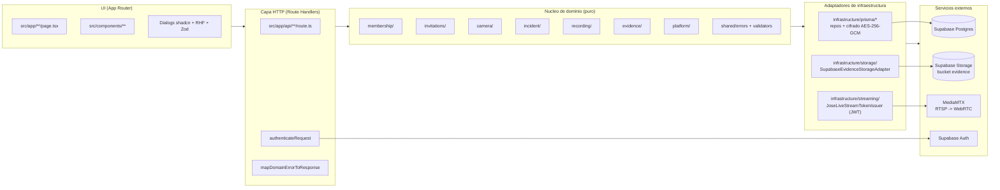
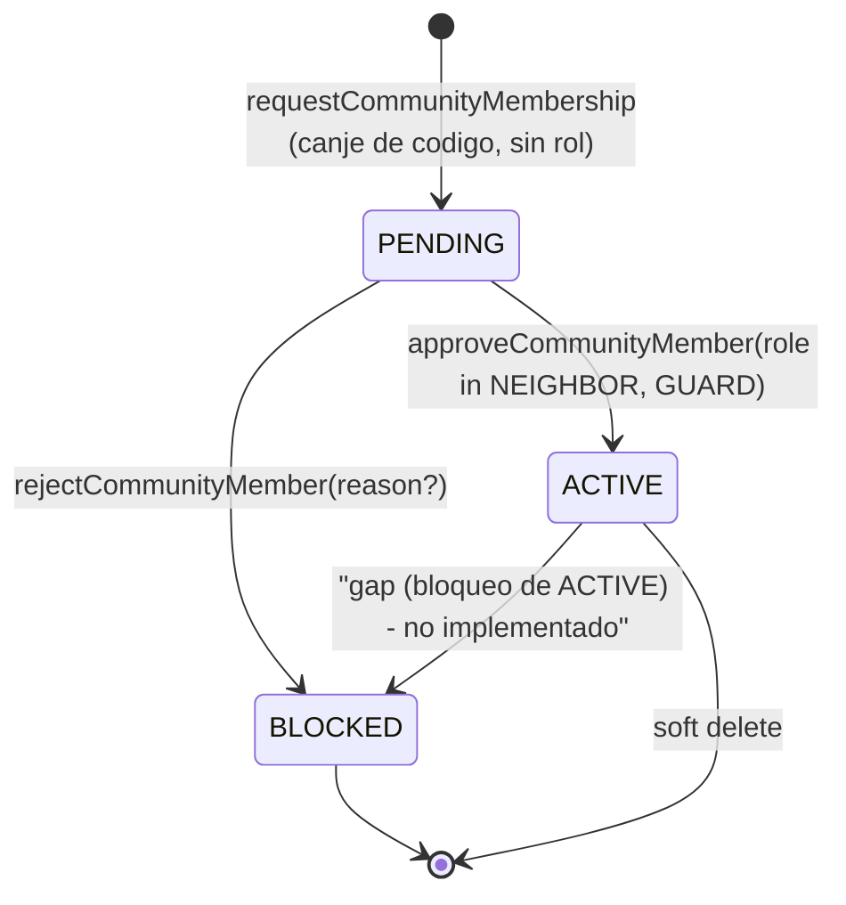
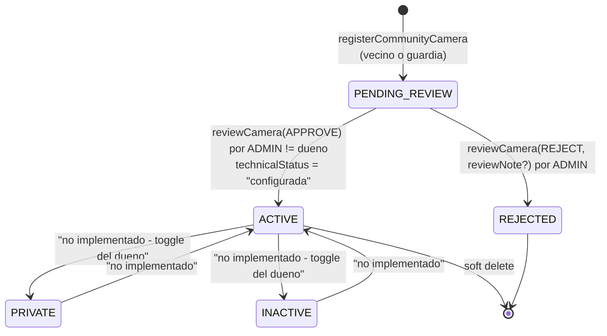
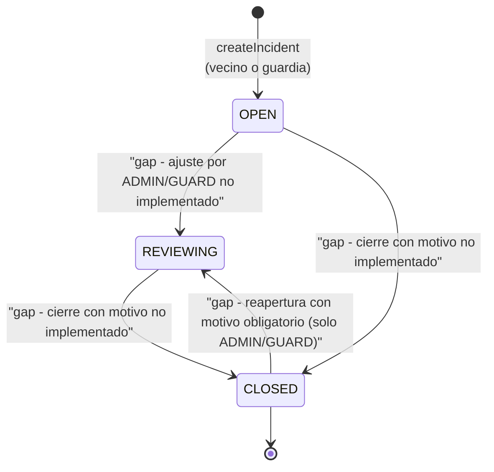
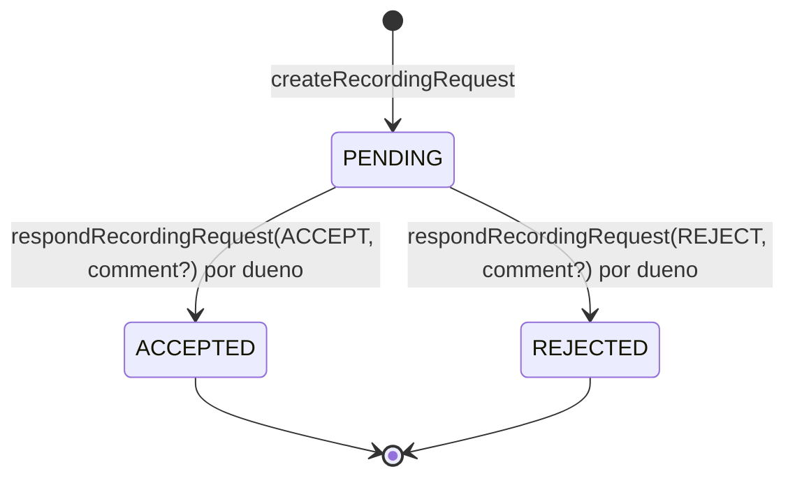
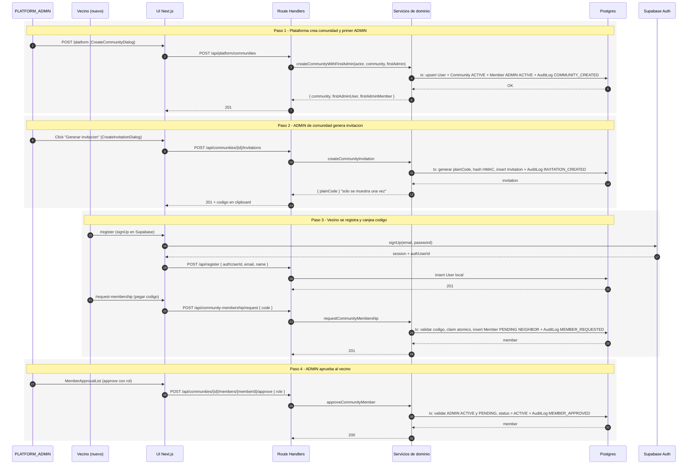
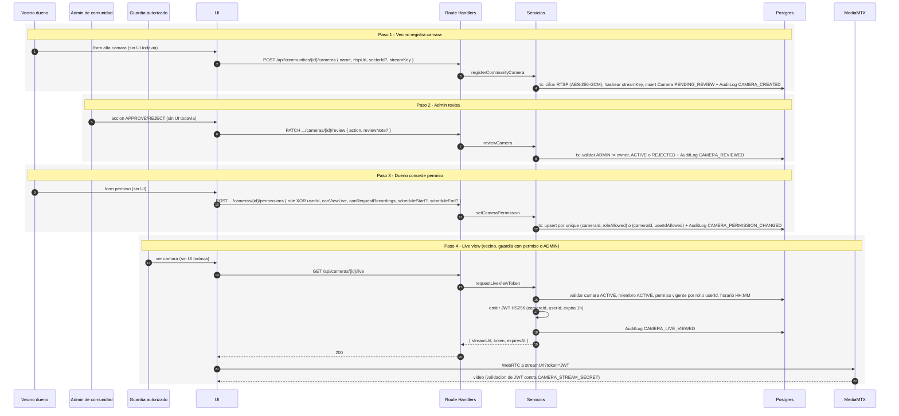
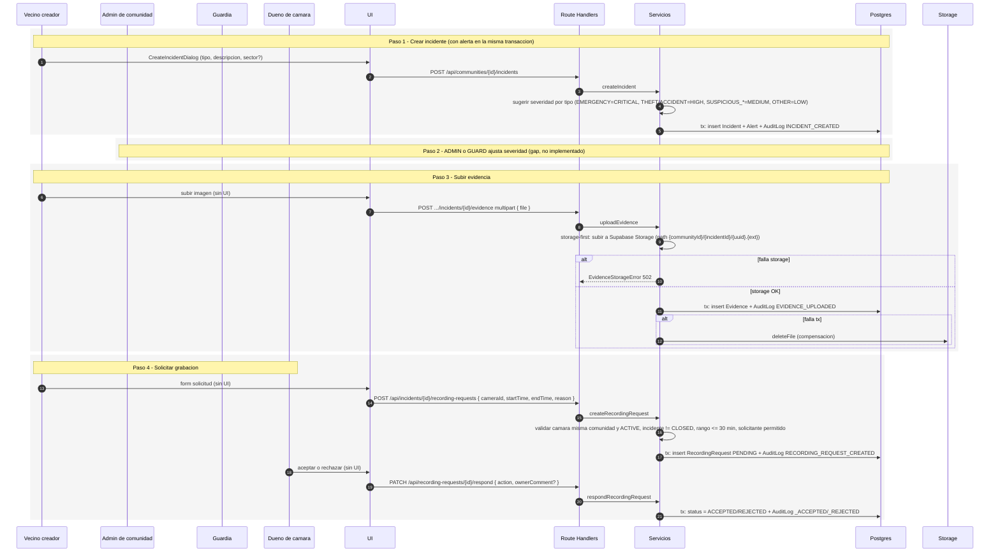

# Arquitectura y Logica del Proyecto

> Documento overview. Para el dominio, modelos, reglas y decisiones ver `CONTEXT.md` y `docs/adr/`.

Este archivo resume la logica actual de **Camaras Comunitarias** mediante diagramas. El codigo fuente es la verdad; estos diagramas son un mapa legible para entenderlo.

---

## 1. Vision general

Red privada de seguridad comunitaria con stack:

- **Frontend y API**: Next.js 16 (App Router, `proxy.ts` como middleware), React 19, TypeScript, Tailwind v4, shadcn/ui, RHF + Zod.
- **Persistencia**: Supabase Postgres con Prisma 7.8 (`@prisma/adapter-pg`).
- **Auth**: Supabase Auth (sesion en cookies + `authenticateRequest` server-side).
- **Storage**: Supabase Storage (bucket `evidence` por defecto).
- **Streaming**: MediaMTX externo; la app solo emite un JWT HS256 que el servidor de medios valida (ADR-0004).
- **Real-time**: pendiente. ADR-0002 reserva Socket.IO como servicio Node separado.
- **Push**: FCM fuera del MVP inicial.

El patron general de cada operacion es:

```
Cliente (Browser)
  -> proxy.ts valida sesion para rutas protegidas
  -> Route Handler en src/app/api/**/route.ts
     1. authenticateRequest (Supabase session)
     2. buscar User local por authProviderId
     3. validar body con Zod
     4. ejecutar servicio de dominio dentro de prisma.$transaction
     5. mapear errores de dominio a HTTP (ADR-0007/0009/0010)
```

---

## 2. Arquitectura hexagonal (capas)



Reglas de la arquitectura:

- `domain/**` no importa de `infrastructure/**` ni de `next/*`. Los servicios reciben `Deps` por inyeccion (repos, ports).
- Cada operacion de mutacion corre dentro de `prisma.$transaction` para que el cambio de negocio y el `AuditLog` correspondiente sean atomicos.
- Los errores de dominio extienden `DomainError` y exponen `httpResponse(ctx)` propio (ADR-0010). El handler nunca traduce mensajes manualmente.
- Toda respuesta sensible valida comunidad del actor contra comunidad del recurso.

---

## 3. Modelo de datos (Prisma)

```mermaid
erDiagram
  User ||--o| CommunityMember : "tiene una membresia (MVP single-community)"
  Community ||--o{ CommunityMember : "tiene"
  Community ||--o{ CommunitySector : "tiene 0..N"
  Community ||--o{ CommunityInvitation : "emite"
  Community ||--o{ Camera : "contiene"
  Community ||--o{ Incident : "registra"
  Community ||--o{ SosEvent : "registra"
  Community ||--o{ Alert : "genera"
  Community ||--o{ Evidence : "almacena"
  Community ||--o{ AuditLog : "audita"
  CommunitySector ||--o{ CommunityMember : "agrupa"
  CommunitySector ||--o{ Camera : "agrupa"
  CommunitySector ||--o{ Incident : "opcional"
  CommunitySector ||--o{ SosEvent : "opcional"
  CommunitySector ||--o{ Alert : "opcional"
  User ||--o{ Camera : "es dueno de"
  User ||--o{ Incident : "crea"
  User ||--o{ SosEvent : "crea"
  User ||--o{ Evidence : "sube"
  User ||--o{ IncidentComment : "escribe"
  User ||--o{ CommunityInvitation : "crea"
  User ||--o{ CameraPermission : "permitido por userId"
  User ||--o{ RecordingRequest : "solicita"
  User ||--o{ RecordingRequest : "es dueno de camara"
  User ||--o{ AuditLog : "actor"
  Camera ||--o{ CameraPermission : "tiene 0..N"
  Camera ||--o{ RecordingRequest : "es solicitada en"
  Incident ||--o{ Evidence : "adjunta"
  Incident ||--o{ Alert : "genera"
  Incident ||--o{ IncidentComment : "tiene"
  Incident ||--o{ RecordingRequest : "motiva"
  SosEvent ||--o{ Alert : "genera"

  User {
    uuid id PK
    uuid authProviderId "unique -> Supabase user id"
    string email "unique"
    string name
    PlatformRole platformRole "PLATFORM_ADMIN o null"
    datetime deletedAt "soft delete"
  }
  Community {
    uuid id PK
    string name
    string address
    CommunityStatus status "ACTIVE | SUSPENDED | ARCHIVED"
  }
  CommunityMember {
    uuid id PK
    uuid userId "unique (una sola comunidad en MVP)"
    uuid communityId FK
    uuid sectorId FK "nullable"
    CommunityMemberRole role "NEIGHBOR | ADMIN | GUARD"
    CommunityMemberStatus status "PENDING | ACTIVE | BLOCKED"
  }
  CommunitySector {
    uuid id PK
    uuid communityId FK
    string name
    unique "(communityId, name)"
  }
  CommunityInvitation {
    uuid id PK
    uuid communityId FK
    string codeHash "unique (HMAC-SHA256)"
    datetime expiresAt "MVP: null"
    datetime usedAt "claim atomico"
    datetime revokedAt
  }
  Camera {
    uuid id PK
    uuid communityId FK
    uuid ownerId FK
    uuid sectorId FK "nullable"
    string name
    string description
    string approximateLocation
    string rtspUrlEncrypted "AES-256-GCM, iv:tag:cipher hex"
    string streamKeyHash "SHA-256"
    CameraStatus status "PENDING_REVIEW | ACTIVE | INACTIVE | PRIVATE | REJECTED"
    string technicalStatus "configurada | pendiente | error | offline"
  }
  CameraPermission {
    uuid id PK
    uuid cameraId FK
    CommunityMemberRole roleAllowed "XOR userIdAllowed"
    uuid userIdAllowed "XOR roleAllowed"
    bool canViewLive
    bool canRequestRecordings
    string scheduleStart "HH:MM nullable"
    string scheduleEnd "HH:MM nullable"
    unique "(cameraId, roleAllowed)"
    unique "(cameraId, userIdAllowed)"
  }
  Incident {
    uuid id PK
    uuid communityId FK
    uuid createdById FK
    uuid sectorId FK "nullable"
    IncidentType type "THEFT | SUSPICIOUS_PERSON | SUSPICIOUS_VEHICLE | EMERGENCY | ACCIDENT | OTHER"
    AlertSeverity severity "LOW | MEDIUM | HIGH | CRITICAL"
    IncidentStatus status "OPEN | REVIEWING | CLOSED"
    string description
    string location
    string closedReason
    datetime closedAt
  }
  SosEvent {
    uuid id PK
    uuid communityId FK
    uuid createdById FK
    uuid sectorId FK "nullable"
    IncidentStatus status "OPEN | REVIEWING | CLOSED (mismo enum)"
    string approximateLocation
  }
  Evidence {
    uuid id PK
    uuid communityId FK
    uuid incidentId FK
    uuid uploadedById FK
    string storagePath "{communityId}/{incidentId}/{uuid}.{ext}"
    string mimeType "image/jpeg | image/png | image/webp"
    json metadata
    datetime deletedAt
  }
  IncidentComment {
    uuid id PK
    uuid incidentId FK
    uuid authorId FK
    string message
  }
  Alert {
    uuid id PK
    uuid communityId FK
    uuid incidentId FK "nullable"
    uuid sosEventId FK "nullable"
    uuid sectorId FK "nullable"
    AlertSeverity severity
    string type "libre (etiqueta visible)"
    string message
  }
  RecordingRequest {
    uuid id PK
    uuid incidentId FK
    uuid cameraId FK
    uuid requestedById FK
    uuid ownerId FK
    datetime startTime
    datetime endTime "startTime < endTime, max 30 min"
    string reason
    RecordingRequestStatus status "PENDING | ACCEPTED | REJECTED"
    string ownerComment
  }
  AuditLog {
    uuid id PK
    uuid communityId FK "nullable"
    uuid actorId FK "nullable"
    AuditAction action "20 valores enumerados"
    string entityType
    uuid entityId
    json metadata
  }
```

### Datos sensibles y como se protegen

| Campo | Proteccion | Donde se documenta |
|---|---|---|
| `User.authProviderId` | Unico, FK logica contra Supabase Auth | `prisma/schema.prisma` |
| `CommunityInvitation.codeHash` | HMAC-SHA256 con `INVITE_CODE_PEPPER`; el `plainCode` se muestra una sola vez | `src/lib/crypto.ts`, servicio `createCommunityInvitation` |
| `Camera.rtspUrlEncrypted` | AES-256-GCM, key derivada con SHA-256 de `CAMERA_RTSP_SECRET`, formato `iv:authTag:ciphertext` hex | ADR-0003, `infrastructure/prisma/camera-repository.ts` |
| `Camera.streamKeyHash` | SHA-256 | ADR-0003 |
| Token de live view | JWT HS256 con `CAMERA_STREAM_SECRET`, claims `{cameraId, userId}`, expira en 1h | ADR-0004, `infrastructure/streaming/jose-live-stream-token-issuer.ts` |
| URLs de evidencia | Signed URLs de Supabase Storage con expiracion 1h, generadas por `getEvidence` y `uploadEvidence` | ADR-0008, `infrastructure/storage/supabase-evidence-storage.ts` |

Reglas duras: la RTSP y el `streamKeyHash` **nunca** se envian al cliente ni al ADMIN de comunidad; el `streamKey` se reemplaza si cambia, no se lee ni se muestra.

---

## 4. Maquinas de estado

### 4.1 CommunityMember



- PENDING no ve camaras, incidentes ni evidencia.
- En el MVP un usuario pertenece a una sola comunidad (`@unique(userId)`).
- Promocion a ADMIN: **no implementada** todavia. `approveCommunityMember` acepta solo NEIGHBOR o GUARD. El CONTEXT.md pide que un ADMIN activo pueda promover a otro ACTIVE a ADMIN.

### 4.2 Camera



Reglas vigentes:

- Solo camaras `ACTIVE` admiten permisos y emiten streams (`requestLiveViewToken` lo rechaza si no).
- Permisos para camaras en cualquier otro estado **no tienen efecto**.
- El dueno controla `name`, `description`, `approximateLocation`, `sectorId`. `rtspUrlEncrypted` y `streamKeyHash` no son editables.

### 4.3 Incident



El modelo soporta el ciclo completo, pero el servicio y la API para cambiar el estado **no estan implementados** todavia (gap vs CONTEXT.md).

### 4.4 RecordingRequest



Reglas: el solicitante no puede cancelar; se permiten multiples solicitudes para la misma camara en el mismo incidente; el rango horario maximo es 30 minutos; la camara y el incidente deben ser de la misma comunidad.

---

## 5. Mapa de capacidades por rol (autorizacion)

| Capacidad | Vecino (NEIGHBOR) | Guardia (GUARD) | Admin de comunidad | Admin de plataforma |
|---|---|---|---|---|
| Crear comunidad | no | no | no | si |
| Definir primer ADMIN | no | no | no | si |
| Generar invitaciones | no | no | si | no |
| Aprobar miembros | no | no | si | no |
| Bloquear miembros | no | no | si | no |
| Registrar camaras propias | si | si | si | no |
| Aprobar/rechazar camaras | no | no | si (excepto propias) | no |
| Conceder permisos de su camara | si | si | si (en su camara) | no |
| Ver live view | si, con permiso vigente | si, con permiso vigente | si, con permiso o excepcion | no |
| Crear incidente | si | si | no (regla actual) | no |
| Ajustar severidad | no | si | si | no |
| Crear solicitud de grabacion | si (si es creador) | si | si | no |
| Aceptar/rechazar solicitud | no (es dueno) | no (es dueno) | no (es dueno) | no |
| Subir evidencia | si | si | si | no |
| Ver evidencia | si (si es creador del incidente) | si | si | no |
| Ver soporte de plataforma a datos privados | - | - | - | no por defecto, debe ser excepcional y auditado |

---

## 6. Flujos end-to-end (sequence diagrams)

### 6.1 Onboarding completo: comunidad + invitacion + membresia



### 6.2 Camara: registrar -> revisar -> permiso -> live view



Validaciones clave que la aplicacion aplica antes de emitir el token:

1. Camara en estado `ACTIVE` y comunidad `ACTIVE`.
2. Usuario es miembro `ACTIVE`.
3. Si es `ADMIN` de la comunidad: pasa derecho (regla de operacion).
4. En otro caso: existe permiso por `roleAllowed` o por `userIdAllowed` con `canViewLive = true` y la hora actual cae dentro de `scheduleStart..scheduleEnd` (soporta cruce de medianoche, rechaza `start == end`).
5. Si todo OK: emite JWT HS256 firmado con `CAMERA_STREAM_SECRET` con expiracion 1h y devuelve `streamUrl = MEDIA_SERVER/stream/{cameraId}?token={jwt}`.

### 6.3 Incidente + alerta + solicitud de grabacion



Visibilidad de evidencia: solo el creador del incidente, ADMIN de comunidad y GUARD autorizado ven la lista (NEIGHBOR no creador esta excluido). Cada visualizacion genera un `AuditLog EVIDENCE_VIEWED` por item, con signed URLs de 1h.

---

## 7. Mapa de endpoints por capa

| Metodo | Path | Servicio de dominio | Permisos |
|---|---|---|---|
| POST | `/api/register` | (Prisma directo) | sesion Supabase valida |
| POST | `/api/community-membership/request` | `requestCommunityMembership` | usuario autenticado |
| POST | `/api/communities/{communityId}/invitations` | `createCommunityInvitation` | ADMIN ACTIVE |
| POST | `/api/communities/{communityId}/members/{memberId}/approve` | `approveCommunityMember` | ADMIN ACTIVE |
| POST | `/api/communities/{communityId}/members/{memberId}/reject` | `rejectCommunityMember` | ADMIN ACTIVE |
| POST | `/api/communities/{communityId}/cameras` | `registerCommunityCamera` | miembro ACTIVE |
| PATCH | `/api/communities/{communityId}/cameras/{cameraId}/review` | `reviewCamera` | ADMIN ACTIVE (no dueno) |
| POST | `/api/communities/{communityId}/cameras/{cameraId}/permissions` | `setCameraPermission` | dueno de camara |
| DELETE | `/api/communities/{communityId}/cameras/{cameraId}/permissions/{permissionId}` | `removeCameraPermission` | dueno de camara |
| GET | `/api/cameras/{cameraId}/live` | `requestLiveViewToken` | miembro ACTIVE con permiso vigente o ADMIN |
| POST | `/api/communities/{communityId}/incidents` | `createIncident` | miembro ACTIVE NEIGHBOR/GUARD |
| POST | `/api/communities/{communityId}/incidents/{incidentId}/evidence` | `uploadEvidence` | miembro ACTIVE |
| GET | `/api/communities/{communityId}/incidents/{incidentId}/evidence` | `getEvidence` | creador del incidente o ADMIN/GUARD |
| POST | `/api/incidents/{incidentId}/recording-requests` | `createRecordingRequest` | creador del incidente, ADMIN o GUARD |
| PATCH | `/api/recording-requests/{requestId}/respond` | `respondRecordingRequest` | dueno de la camara |
| POST | `/api/platform/communities` | `createCommunityWithFirstAdmin` | PLATFORM_ADMIN global |

Paginas (`src/app/**/page.tsx`):

- `/`: dispatcher de sesion.
- `/login`, `/register`, `/request-membership`: formularios publicos de auth e ingreso.
- `/platform`: panel para PLATFORM_ADMIN (lista comunidades, crear comunidad).
- `/dashboard`: resumen del miembro ACTIVE (pendientes para ADMIN, conteos, sectores).
- `/cameras`: placeholder visual; las APIs existen pero falta UI de registro/revision/permiso/live.
- `/incidents`: lista incidentes y dispara `CreateIncidentDialog`.

`proxy.ts` (middleware de Next.js 16) protege `/platform`, `/dashboard`, `/cameras`, `/incidents` y redirige a `/login` si no hay sesion.

---

## 8. Gaps vs `CONTEXT.md` (estado del MVP)

El tracer bullet definido en CONTEXT.md esta **parcialmente implementado**. Las piezas verdes son operativas hoy; las amarillas tienen modelo + enums pero no tienen servicio/API/UI; las rojas no estan modeladas todavia.

| Regla | Estado | Detalle |
|---|---|---|
| Crear comunidad por plataforma + primer ADMIN | implementado | `createCommunityWithFirstAdmin` |
| Invitacion + claim atomico | implementado | `createCommunityInvitation`, `requestCommunityMembership` |
| Aprobacion / rechazo de miembro PENDING | implementado | `approveCommunityMember`, `rejectCommunityMember` |
| Promocion a ADMIN de un ACTIVE | gap | falta servicio y endpoint |
| Bloqueo de ACTIVE | gap | solo se bloquea PENDING hoy |
| Registro de camara con cifrado RTSP | implementado | `registerCommunityCamera` |
| Revision por ADMIN (APPROVE/REJECT) | implementado | `reviewCamera` |
| Permisos por rol / por usuario + horario | implementado | `setCameraPermission`, `removeCameraPermission` |
| Edicion de camara por dueno | gap | sin servicio/API |
| Listado de camaras de la comunidad | gap | sin servicio/API |
| Listado de miembros | gap | sin servicio/API |
| Live view con JWT | implementado | `requestLiveViewToken` (UI de consumo WebRTC pendiente) |
| Sectores comunitarios: gestion | gap | modelo existe, sin servicio/API/UI |
| Crear incidente + alerta (misma transaccion) | implementado | `createIncident` |
| Cambiar estado de incidente | gap | enums listos, sin servicio/API |
| Comentarios de incidente | gap | modelo `IncidentComment` + enum listos |
| Reapertura de incidente CLOSED con motivo | gap | sin servicio/API |
| Crear solicitud de grabacion (max 30 min) | implementado | `createRecordingRequest` |
| Aceptar / rechazar solicitud por dueno | implementado | `respondRecordingRequest` |
| Subida de evidencia con storage-first | implementado | `uploadEvidence` (UI pendiente) |
| Lectura de evidencia con signed URLs | implementado | `getEvidence` (UI pendiente) |
| SOS | gap | modelo `SosEvent` + enum `SOS_CREATED` listos, sin servicio/API/UI |
| Real-time (Socket.IO) | gap | ADR-0002 reserva la decision; no hay codigo |
| Push (FCM) | fuera del MVP | ADR menciona "queda para iteracion posterior" |

Sugerencia de trazabilidad para cierres: cada gap de arriba puede descomponerse en issues siguiendo el flujo de `to-issues` (tracer-bullet vertical slices) cuando se decida priorizar.

---

## 9. Convenciones operativas

- **Naming**: archivos en kebab-case dentro de `src/` (`register-community-camera.ts`), componentes y tipos en PascalCase, variables y funciones en camelCase.
- **Errores**: cualquier error de dominio extiende `DomainError` y expone `httpResponse(ctx)`. Nunca se hace `instanceof DomainError` en handlers salvo por la implementacion del propio mapeador.
- **Tests**: co-localizados junto al codigo (`*.test.ts`). Total actual: **23 archivos** cubriendo validadores, errores, todos los servicios de dominio, los dos adaptadores externos (storage, streaming) y dos endpoints (`/api/platform/communities` y `/api/.../evidence`).
- **Verificacion visual**: cualquier cambio de UI debe pasar por `DESIGN.md` primero y validarse con screenshot de Chrome DevTools en mobile + desktop.
- **Documentacion durable**: cambios de reglas de dominio van a `CONTEXT.md`; decisiones arquitectonicas a `docs/adr/NNNN-titulo.md` siguiendo el template.

---

## 10. Referencias cruzadas

- Lenguaje y reglas de dominio: `CONTEXT.md`.
- Sistema visual: `DESIGN.md`.
- Decisiones arquitectonicas: `docs/adr/0001..0010`.
- Referencia HTTP (request/response de cada endpoint): `docs/api-reference.md`.
- Workflow de agentes y triage: `AGENTS.md`, `docs/agents/`.
